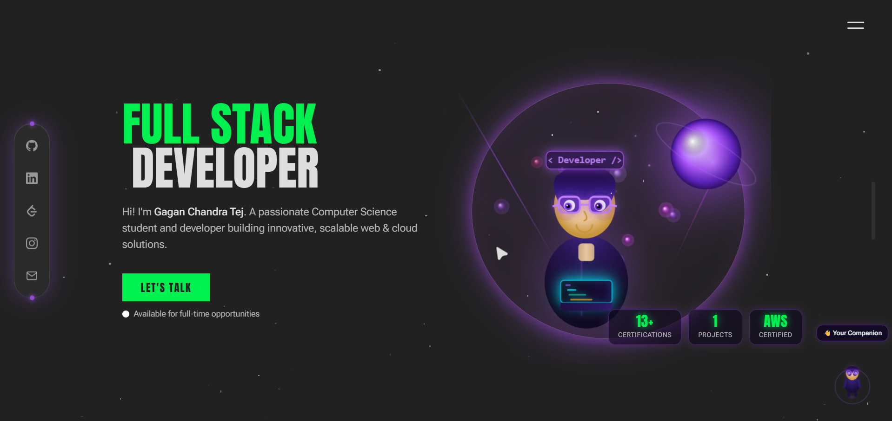

# 🚀 My Portfolio Website



🌐 **Live Demo:** https://my-portfolio-sage-zeta-64.vercel.app/

---

# 👋 About

Hi! I'm **Vengala Gagan Chandra Tej**, a passionate Full Stack Developer and Computer Science student focused on building modern, scalable web applications and cloud solutions.

This portfolio showcases my projects, technical skills, certifications, and experience in web development, cloud computing, and AI.

---

## ✨ Features

- 💻 Modern Responsive Design
- ⚡ Built with Next.js
- 🎨 Smooth Animations
- 🌙 Dark Theme UI
- 🔐 Authentication with Supabase
- ☁️ Cloud Deployment on Vercel
- 📱 Fully Responsive
- 📄 Resume Download
- 📬 Contact Section
- 🏆 Certifications Showcase

---

## 🛠 Tech Stack

### Frontend

- Next.js
- React
- TypeScript
- Tailwind CSS
- Framer Motion

### Backend

- Supabase
- PostgreSQL

### Cloud & Tools

- AWS
- Git & GitHub
- Vercel
- Figma

---

## 🚀 Installation

Clone the repository

```bash
git clone https://github.com/Gagan3287/My-Portfolio.git
```

Go to the project folder

```bash
cd My-Portfolio
```

Install dependencies

```bash
pnpm install
```

Run the development server

```bash
pnpm dev
```

Open

```
http://localhost:3000
```

---

## 🌐 Live Website

👉 **Portfolio:**  
https://my-portfolio-sage-zeta-64.vercel.app/

---


---

## 🤝 Contributing

Contributions, issues, and feature requests are welcome!

If you'd like to improve this project:

1. Fork the repository
2. Create your feature branch
3. Commit your changes
4. Push to the branch
5. Open a Pull Request

---

## ⭐ Support

If you like this project, consider giving it a ⭐ on GitHub.

Repository:

https://github.com/Gagan3287/My-Portfolio

---

## 📬 Connect With Me

GitHub:
https://github.com/Gagan3287

LinkedIn:
https://www.linkedin.com/in/vengala-gagan-chandra-tej/

Portfolio:
https://my-portfolio-sage-zeta-64.vercel.app/

---

## 📄 License

This project is licensed under the **MIT License**.
https://github.com/Gagan3287/My-Portfolio/blob/main/LICENSE
See the LICENSE file for more information.
